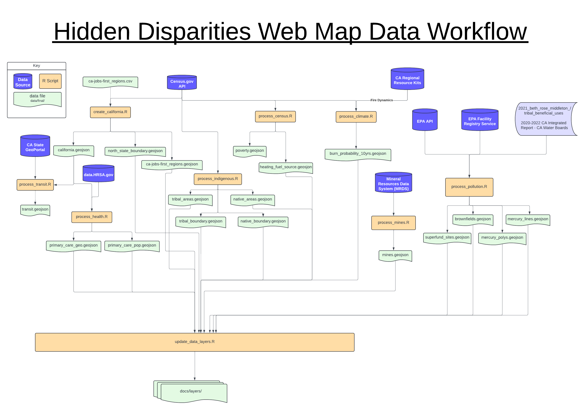

<!--
DataLab Project Template

Replace allcaps text with your project details. PROJECT_NAME should be your
project's short name.

On GitHub, name the project repository according to the following format:

YEAR_COLLABORATOR_PROJECT_NAME

The project's Google Drive directory should also follow this format.

In the listing of directories, delete anything that isn't relevant to your
project.
-->

# North State Environmental Justice Web Map Project

This repository contains code for the North State Environmental Justice Web Map
project for the California Jobs First Initiative. CA Jobs First is an initiative
by the State of California that "seeks to center disadvantaged communities as 
part of California’s transition to a clean energy, carbon neutral economy, 
creating good-paying jobs and prosperous communities for all."

Links:

* [Google Drive][drive]
* [Meeting Notes][notes]
* [Data Workflow][lucidchart]

[drive]: https://drive.google.com/drive/u/0/folders/1fQx87v7HprrFe8Gm9CL_RTO2P8OSDqMD
[notes]: https://docs.google.com/document/d/1feErW5DmZl703eZ0B8XJ1VA2SE6kgOJHRBCouEDabYE/edit?usp=sharing
[lucidchart]: https://lucid.app/lucidchart/4df33c99-b4b9-4f39-8539-1b8bd5945b9b/edit?invitationId=inv_82063fb3-2203-44f2-b550-be286d3601ca&page=0_0#

## File and Directory Structure

The directory structure for the project is:

```
data/           Data sets (located on google drive)
└── raw/        Downloaded, unprocessed (raw) data
└── clean/      Cleaned data, may or may not be going on the map
└── final/      Cleaned data, is going on the map
docs/           Web map files
└── index.html  Primary web map file
└── layers/     Data layers for web map (.js)
└── icons/      Icons for map
R/              R source code for cleaning data
census_api_key.txt
README.md
```

## Data Sources

All data that has been manually downloaded from the internet should be stored in 
`data/raw/`. 

A lot of the data comes from the US Census API, and does not need to be
downloaded manually. Instead you can download the data directly from R. However,
in order to do this you need to set up an API key. In order to do that go to 
[Census API Key Sign Up][census_api] and request a key. Once the Census emails 
you a key, copy and paste it into a text file called `census_api_key.txt`.

[census_api]: https://api.census.gov/data/key_signup.html

### Source By Map Layer

* CA Jobs First Economic Regions, North State Region
  * data/raw/ca-jobs-first_regions.csv (manually created)
  * Census API
  * Generated using `R/create_california.R`

* Tribal Land, High Native Population
  * Census API
  * Generated using `R/process_indigenous.R`
  
* Fire Risk
  * https://caregionalresourcekits.org/statewide.html#fire_dyn, Annual Burn 
    Probability - August 2022, raw data
  * Generated using `R/process_climate.R`

* High Poverty Areas
  * Census API
  * Generated using `R/process_census.R`

* Primary Care Provider Shortage
  * https://data.hrsa.gov/data/download, Shortage Areas -> HPSA Primary Care -> 
    Area HPSA Designation Boundaries - SHP
  * Data can be downloaded automatically in script
  * Generated with `R/process_health.R`

* Heating Fuel Sources
  * Census API
  * Generated with `R/process_census.R`
  
* Superfund Sites
  * EPA/ArcGIS API
  * Generated with `R/process_pollution.R`

* Brownfields Sites
  * https://www.epa.gov/frs/geospatial-data-download-service 
  * Geospatial Data Download, Geospatial information for all publicly 
    available FRS facilities that have latitude/longitude data.
  * Data can be downloaded automatically in script
  * Generated with `R/process_pollution.R`

* Mercury Impacted Waterways
  * From a previous DataLab project 
  * Generated with `R/process_pollution.R`

* Mines
  * [USGS MRDS Geo Inventory][mrds] -> California -> Download Shapefile
  * Data can be downloaded automatically in the script
  * Generated with `R/process_mines.R`

[mrds]: https://mrdata.usgs.gov/mrds/geo-inventory.php

* Transit
  * [Caltrans Transit Routes][transit]
  * Downloaded GeoJSON
  * Generated with `R/process_transit.R`
  

[transit]: https://gis.data.ca.gov/datasets/dd7cb74665a14859a59b8c31d3bc5a3e_0/about

## Data Workflow



<!--
The files in the `data/` directory are:

```

```
-->
